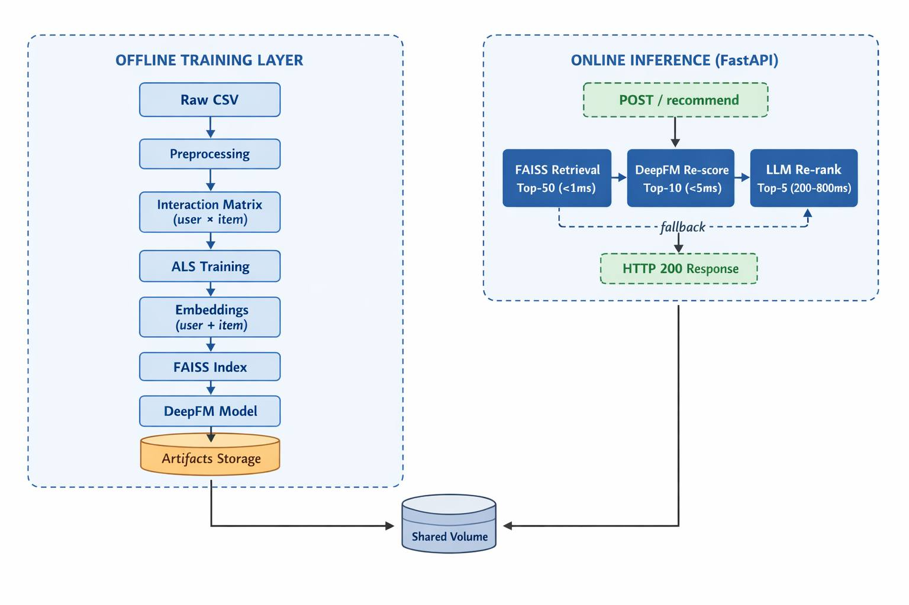

# E-commerce Recommendation System

End-to-end production-ready recommendation system for the **Retailrocket** e-commerce dataset.  

## Dataset

This project uses the **Retailrocket** e-commerce behavior dataset, including user events, item properties, and category metadata.

Dataset reference: [Retailrocket](https://www.kaggle.com/code/duvvurum/starter-retailrocket-recommender-c494d61f-f)

---

## I. Architecture



---

## II. Model Design

### 1. Configuration

All hyperparameters in `configs/config.yaml`:

| Section | Key | Default | Notes |
|---------|-----|---------|-------|
| `retrieval` | `embedding_dim` | 64 | Two-Tower output dim |
| `retrieval` | `batch_size` | 2048 | Safe for 16 GB Mac |
| `retrieval` | `temperature` | 0.07 | InfoNCE temperature |
| `ranking` | `field_emb_dim` | 16 | DeepFM field embedding dim |
| `ranking` | `hidden_dims` | [256,128,64] | Deep MLP layers |
| `faiss` | `top_n` | 50 | Retrieval candidates |
| `data` | `history_len` | 20 | Last-K items for user tower |

---

### 2. Two-Tower Retrieval
| Component | Detail |
|-----------|--------|
| User Tower | Weighted average of last-K item embeddings -> MLP -> L2-norm |
| Item Tower | item_emb + category_emb + price_emb -> MLP -> L2-norm |
| Training   | InfoNCE loss with in-batch negatives (batch=2048) |
| Output     | 64-dim L2-normalised vectors, dot-product similarity |

### 3. DeepFM Ranking
| Component | Detail |
|-----------|--------|
| Fields    | 7 fields: category_id, event_type, price_bucket, recency_bucket, popularity_bucket, user_emb_proj, item_emb_proj |
| FM part   | Efficient order-2 feature interactions |
| Deep part | MLP 256->128->64->1 with LayerNorm + Dropout |
| Output    | Sigmoid score for ranking |

---

## III. Quick Start

### 1. Environment Setup

```powershell
python -m venv .venv
.venv\Scripts\Activate.ps1
python -m pip install --upgrade pip
pip install -r requirements.txt
```

Make sure the raw Retailrocket files exist in `data/raw/`:

- `events.csv`
- `item_properties_part1.csv`
- `item_properties_part2.csv`
- `category_tree.csv`

### 2. Run Full Pipeline

Run the entire offline training and evaluation pipeline:

```powershell
python scripts/train_pipeline.py
```

This command executes the following stages in order:

| Step | Module | Key output |
|------|--------|------------|
| 1 | `data.preprocess` | `train/val/test.parquet`, `item_meta.parquet`, ID maps |
| 2 | `retrieval.train_two_tower` | `item_embeddings.npy`, `two_tower.pt` |
| 3 | `retrieval.export_embeddings` | float32 normalised embeddings |
| 4 | `faiss_index.build_index` | `item_index.faiss` |
| 5 | `ranking.train_ranker` | `user_embeddings.npy` (memmap), `deepfm.pt` |
| 6 | `evaluation.evaluate` | `evaluation/results/evaluation_results.json` |

### 3. Validation & Analysis

Use batch inference to inspect recommendation outputs for multiple users without starting the API server.

```powershell
python scripts/inference_pipeline.py --user-ids 0 1 2 3 --top-k 5
python scripts/inference_pipeline.py --user-ids 0 1 --output recs.json
```
Use evaluation to compute ranking quality metrics on the offline split. Results are printed and saved to `evaluation/results/evaluation_results.json`:

```powershell
python -m evaluation.evaluate
```
### 4. API

After the pipeline finishes, the API expects these artefacts to exist:

- `data/processed/user_embeddings.npy`
- `data/processed/item_embeddings.npy`
- `data/processed/item_meta.parquet`
- `data/processed/user_history.parquet`
- `data/processed/item_id_map.json`
- `data/processed/category_map.json`
- `faiss_index/item_index.faiss`
- `retrieval/two_tower.pt`
- `ranking/deepfm.pt`

Start the FastAPI server from the project root:

```powershell
uvicorn api.main:app --reload --host 0.0.0.0 --port 8000
```

Check that the server is up:

```powershell
Invoke-RestMethod -Method Get -Uri "http://127.0.0.1:8000/health"
```

Call the recommendation endpoint.

```powershell
Invoke-RestMethod -Method Post `
  -Uri "http://127.0.0.1:8000/recommend" `
  -ContentType "application/json" `
  -Body '{"user_id":123,"top_k":5}'
```

Example response:

```json
{
  "user_id": 123,
  "recommendations": [
    {"item_id": 46154, "original_id": "91264", "score": 0.9957},
    {"item_id": 13633, "original_id": "27127", "score": 0.9952},
    {"item_id": 231467, "original_id": "459631", "score": 0.9942},
    {"item_id": 35672, "original_id": "70527", "score": 0.9915},
    {"item_id": 113976, "original_id": "226378", "score": 0.9702}
  ]
}
```

Interactive API docs:

- `http://127.0.0.1:8000/docs`

